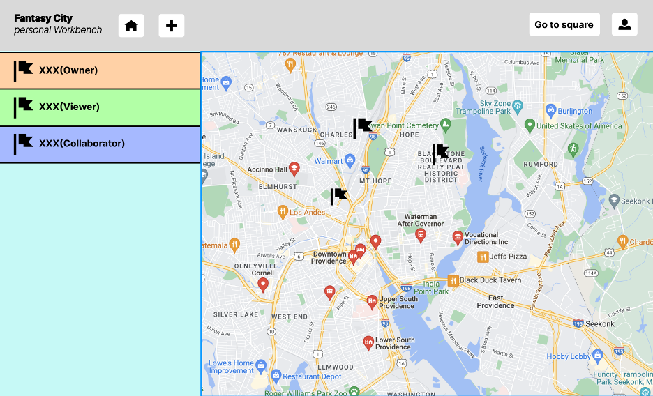
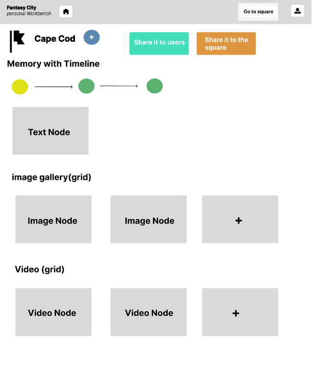
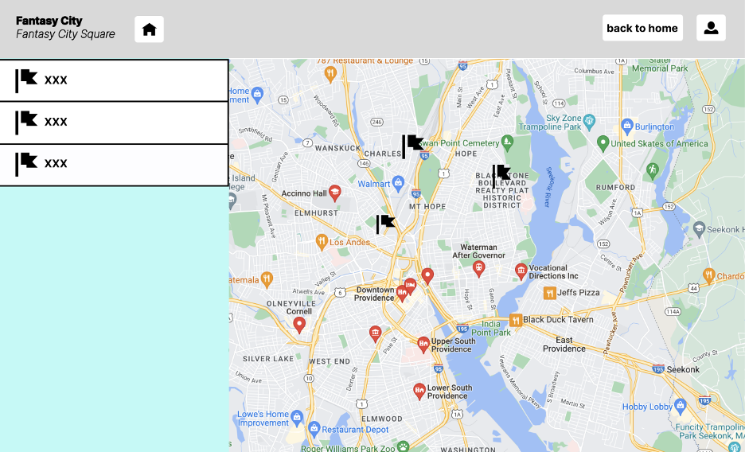
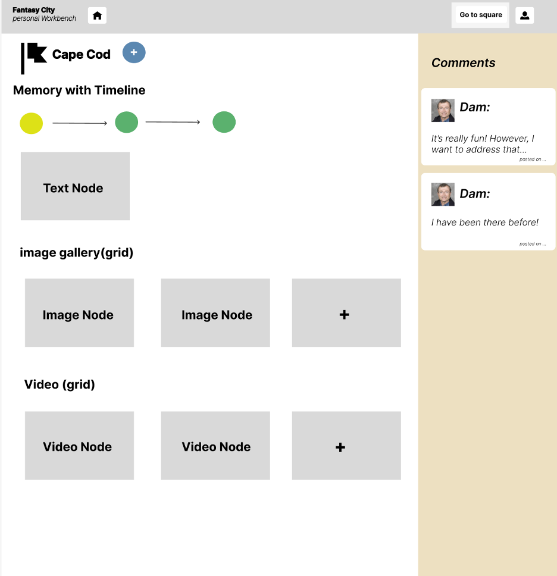
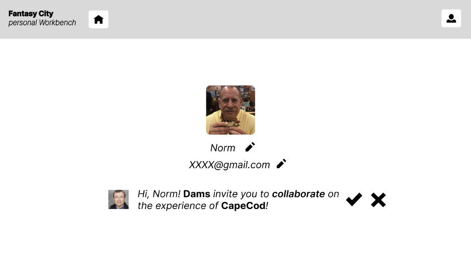

# Final Project

# Fantasy City Project Proposal

## Description

Our project idea is to design an online travelog sharing platform which can support multi-user collaborative rich media/information edition on different locations via workbench and community-based sharing and interaction via fantasy city square.

There will be two different interfaces for each user:

- **Workbench** : Users can manage their own travelogs on different locations via workbench. They can create new locations, add rich media information to it and manage them according to their permissions.
- **Fantasy City Square** : This square will display all the travelogs shared by users. Users will not have the right to edit the shared travelogs, but they can make annotations to them. The shared nodes are updated as local edits are made.

According to the functionality, users will have four permissions for node editing:

- **Owner** : If the node is created by a user in his own workbench, then he will have the owner's permission. Specifically, he can edit, share, delete the node and monitor others' editions.
- **Collaborator:** Users can send invitations to other users for collaboration. Once the other user accepts the invitation, he will have the collaborator's permission and the location node will appear in his workbench. Then He can edit this location node and its sub-nodes. His edition will leave history records to the owner, and he cannot delete the location node.
- **Viewer:** Users can send invitations to other users for collaboration. Once the other user accepts the invitation, he will have the viewer's permission and the location node will appear in his workbench. However, he cannot make any editions to the node.
- **Square Viewer:** In square, all the users have square viewer's permission. They can only view the public nodes without editing them. However, they can make annotations to public nodes.

Also, we will add some new node types on the basis of previous assignments. They are:

- **Map:** A big map node as the root node of workbench and square.
- **Location:** A specific location on the map. It will be the root node for each travelog.
- **Timeline:** The specific timeline for the travelog.
- **Video:** For users to record video moments.
- **Photo album:** A folder that collects all the images and displays them as a grid view.

The new features we provide are:

- **Privatization of node information by logging in**
- **Shareable**
- **Multi-user collaboration**
- **Export as PDF**
- **Annotations**

## **Use Cases**

Support for user accounts is critical for permissions, interactions, private logs, public domains, and many other features. Users can create and edit user-specified travel logs on the map by logging in with their own account. Users can share inviting links to target users in either a read-only or editable permission format to encourage multi-user cooperation and sharing. Furthermore, they can simply choose to publish information in public domains so that all users can benefit from it. The rich media and editor system allows users to publish annotations, logs, videos and photos of each node of the tour. Users can export their travel logs as pdf files. The goal of this proposal is to create a travelog sharing platform that allows tourists to record their travels with visualized geographical locations and editable content, while also allowing them to help more people by sharing and publicly publishing.

## **Specific Features**

We will implement the following new features:

- **Users**

- Users will be able to register, login, and logout of accounts.

- Users will be able to edit in their own workbench.

- Users will be able to share workbenches with other users for read-only or editable permissions.

- Users will be able to publish their travelog in public.

- **Node contents**

- Every root node is a map with all its child nodes displayed in visualized geographical locations.

- Child nodes are editable for images so that users can upload and edit their travel photos.

- Child nodes are editable for texts so that users can upload and edit their travel annotations and logs.

- Child nodes will be able to support uploading videos.

- Child nodes will be able to support users with timeline and edit history.

- Child nodes will be able to support users to add, edit and follow links between different contents.

- **Node permissions**

- Nodes will only be able to be created by a logged-in user account.

- Nodes in user-specific workbench will only be able to be edited by the creator account and users with editable permissions.

- Nodes in Fantasy City Square will be able to be public, such that all users can view and add annotations by default.

- Nodes in Fantasy City Square will be able to be moved and edited only by the creator accounts.

- **Anchor permissions**

- Users that only have the viewer permissions will not be able to create or delete links and anchors associated with a node.

# Technical Roadmap

## **Overall Design**

- The overall design / structure of your project. How are you building on the architecture from previous assignments? What additional backend or frontend structures you will need to create?

- We will be creating a travelog sharing platform designed to support multi-user rich media/information interaction and enable efficient user access to both public domain and private logs based on user-specified geographical locations. We will add corresponding features to the existing node, anchor, and link services.

## **External Libraries**

- For every component of your project, briefly describe how you will build it and cite (with links) any external libraries or editors you will be using to do so.

- [Ant Design: Avatar Groups](https://ant.design/components/avatar/) - we will use this component to render the different permission groups for a node

- Google Maps: we will use this component to render the travelling world map and location nodes.

- Node.js RSA library: we will use this component to encrypt user password for storage.

## Separation of Responsibility

- Yuanfeng Li will be responsible for implementing the user service and history/timeline functions.

- Chenxin Liu will be responsible for implementing map nodes and updating nodes services.

- Chen Jin will be responsible for updating the link services and implementing video nodes.

- **All members will participate equally in the development of the frontend.**

## **Typescript Interfaces**

```typescript
interfaceIUser {

  userId: string

  account: string

  encryptedPassword: string

  imgUrl: string
}

interfaceIUserGateway {

  createUser(user: IUser): Promise<IServiceResponse<IUser>>;

  getUser(userId: string): Promise<IServiceResponse<IUser>>;

  updateUser(user: IUser): Promise<IServiceResponse<IUser>>;

  deleteUser(userId: string): Promise<IServiceResponse<{}>>;

}

interfaceINode {

  type: NodeType// type of node that is created

  content: any// the content of the node

  filePath: INodePath// unique randomly generated ID which contains the type as a prefix

  nodeId: string// unique randomly generated ID which contains the type as a prefix

  //title: string // user create node title

  dateCreated?: Date// date that the node was created

  public: boolean

  ownerId: string

  viewersId: string[]

  editorsId: string[]

}

exportinterfaceIMapNodeextendsINode {

  center: LatLng

  zoom: number

}

exportinterfaceILocNodeextendsINode {

  position: myLatLng,

  map,

  title: string,

}

exportinterfaceIVideoNodeextendsINode {

  locationNodeId: string

  metaFrame: number,

  curFrame: number,

}

interfaceINodeGateway {

  createNode(node: INode, user: IUser): Promise<IServiceResponse<INode>>;

  getNode((nodeId: string, user?: IUser): Promise<IServiceResponse<INode>>;)

  updateNode(node: INode, user: IUser): Promise<IServiceResponse<INode>>;

  deleteNode((nodeId: string, user: IUser): Promise<IServiceResponse<{}>>;)

  getNodeByPath(filePath: IFilePath, user?: IUser): Promise<IServiceResponse<INode>>;

  moveNode<moveFrom: IFilePath, moveTo: IFilePath, user: IUser): Promise<IServiceResponse<{}>>;

}
```

## Mockup

## Workbench:



By clicking on the location node on the map(or on the left list bar), users will be navigated to the details of the location.



Then, the user can click on each node to edit its information(If he has the right permission), like changing contents, creating links.

If the user clicks on the "go to square" button, then he will see all the shared locations posted by others.



Then, the user can click on each location to see its details! He will not have the right to edit other shared locations, but he can make some annotations to it.

## 

Each user will also have a user profile, where they can edit their user information, and manage their invitations.



##

## **Project Timeline**

Include a timeline showing when you plan to complete each component and what you intend to have done at each checkpoint (can be done with written dates in chronological order or a visual calendar)

_This final project will be due on **Dec 13th**. Therefore, our team will be dissecting the entire project based on each functionality/component._

**Frontend [View]**

- **11/25** – Create and update new frontend gateways
- **11/27** – Create React Components for Personal Travel-log
- **12/03** – Create UI/UX prototype for main pages
- **12/08** – Pass all test for frontend functionalities
- **12/10-12/12** – Finalization of UI/UX design and test for bugs
- **12/13** – Deploy on Firebase

**Backend [Model]**

- **11/23** – Complete user gateway and handlers
- **11/25** – Create and complete CRUD handler for Map, Location, Timeline, Video and Image type nodes
- **11/27 –** Create and complete anchor handlersfor Map, Location, Timeline, Video and Image nodes that handles frontend HTTP requests for anchor CRUD
- **12/01 –** Create and complete link handlers that handles linking requests for all node type
- **11/27** – Create user gateway test suite
- **12/03** – Pass user gateway tests
- **12/05** – Create HTTP test suite
- **12/06** – Pass all test and deploy on Heroku

**Database [Controller]**

- **11/20** – Design and create new schema for Map, Location, Timeline, Video and Photo Album and update existing schema
- **11/22** – Create database connection test suite
- **11/23** – Pass all database connection tests
- **11/26** – Create database CRUD test suite
- **11/27** – Create and pass all tests for database handler
- **11/28** - Pass all tests and deploy on MongoAtlas
